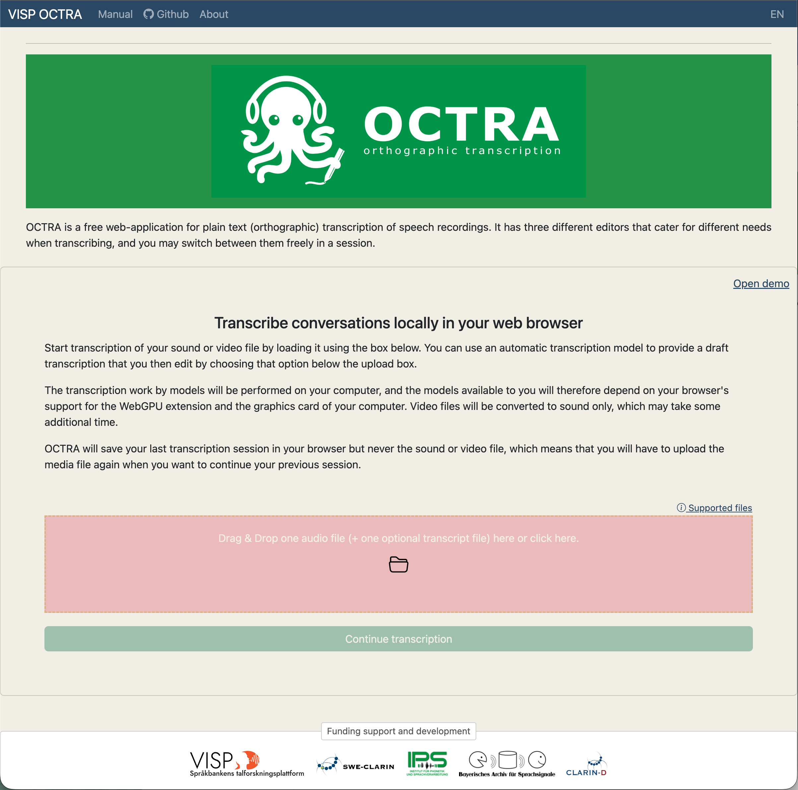
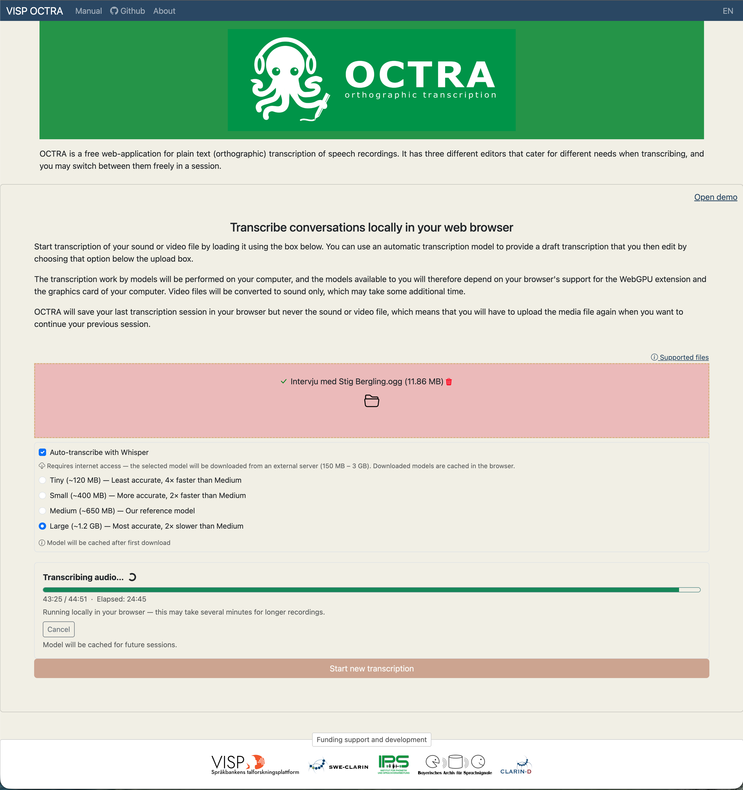
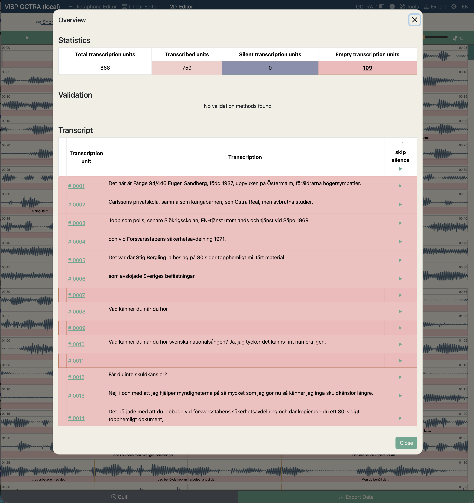
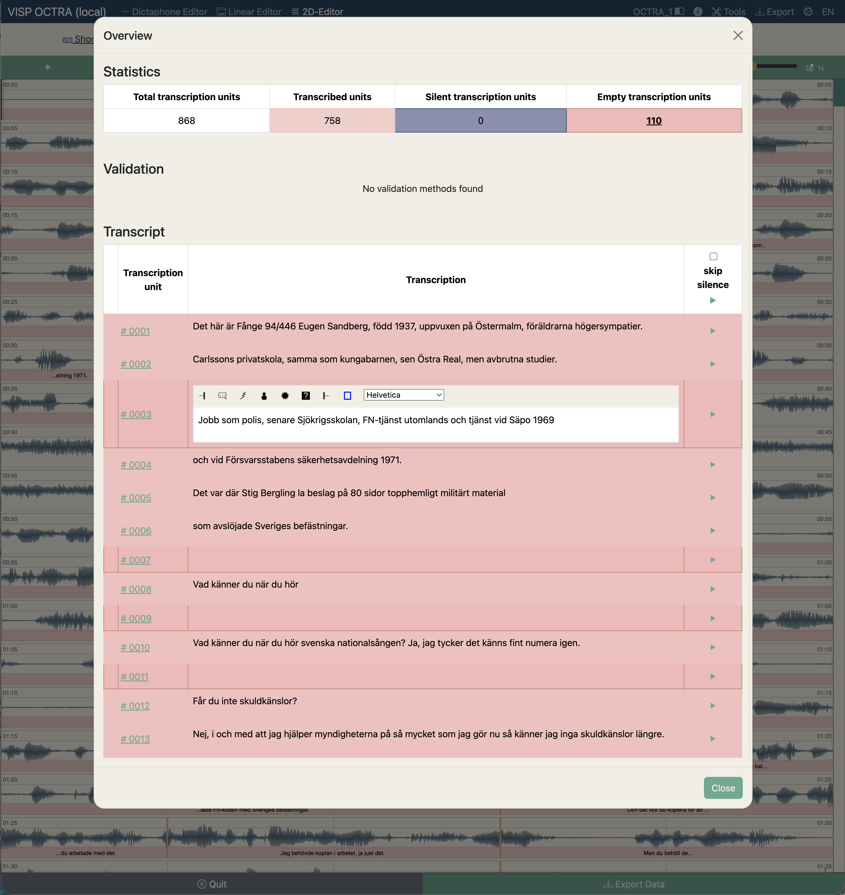
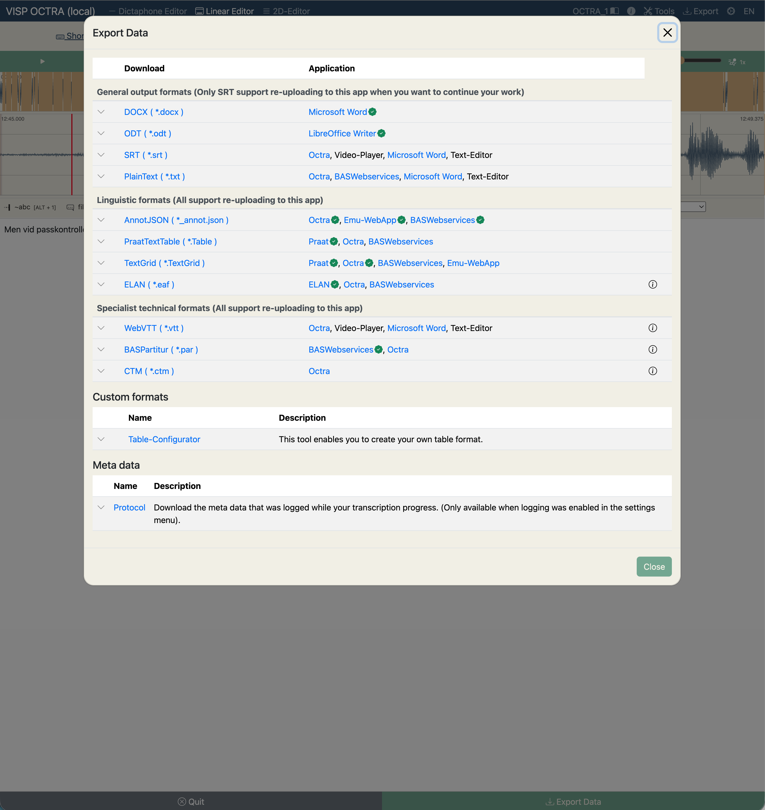

# A Visible Speech flavored OCTRA tool for **o**rthographi**c** **tra**nscription 

The OCTRA tool support the user to perform plain text (orthographic) annotation of the content of an interview, 
monologue, text reading, or any other form of spoken communication act safely and securly in a web browser. Once the app has been opened for the user to interact
with, no communication to external server is performed by the app, and the user can securly use the app to perform the annotation even of the most sensitive interviews or conversations without risk of  
leaking the speech recording to outside parties.

The user can also take advantage of automatic transcription of the audio recording. A speech recognition model will then be downloaded to the user's computer and applied locally to the recording to produce a draft text output. Since the model is run locally on the user's computer, the speed of transcription and also what model sizes (model accuracies) are available will depend on the computers' specifications. Most important is a decent graphics card. 

Once automatic draft transcription have been performed, OCTRA will open the transcript in it's editor views and allow the user to manually edit the transcriptions. 
The user can upload most audio and video formats to OCTRA, and the application will make the audio seamlessly available for the user to work with in the application. If the user uploads a video format that directly supported by the browser (MP4 has the broadest browser support currently, and webm is also a well-supported format), then the app will display the portion of the video with the audio playback when making detailed edits in the popup editor.

## Editors:

Octra supports different editors that you can choose according to your preferences. You can also switch between these easily while you are working on the same task.

* 2D-Editor: This editor breaks the whole view of the signal to pieces and shows the pieces as lines one after one. Here you can set boundaries und define segments too.
* Dictaphone Editor: An typical, easy-to-use editor with just a texteditor and an audioplayer.
* Linear-Editor: This editor shows two signaldisplays: One for the whole view of the signal and one as loupe. You can set boundaries and define segments.

## Some images of the user interface

### The landing page of the application

### The work views inside the application

### Export of transcriptions to a file on your computer

# User Manual

You can find the manual for users here: [OCTRA Manual](https://clarin.phonetik.uni-muenchen.de/apps/octra/manuals/octra/)

## Features in detail

* Three different editors
* Noise markers (placeholders) in the form of icons in text. Icons can be UTF-8 symbols, too.
* Auto-saving of the transcription progress to prevent data loss
* Import/Export support for various file formats like AnnotJSON, Textgrid, Text, Table and more.
* Validation using project specific guidelines in connected mode
* Shortcuts for faster transcriptions
* Multi-Tiers support in local mode
* Logging of user activities for further studies
* Localization of the GUI
* Customization with configuration files for the app, project, guidelines and validation methods.
* Segment boundaries as markers in text
* Overview window to see the whole transcript
* Costom table generator
* Automatic draft transcription
* Support most audio and video file formats 
* Video content may also be displayed in the detailed editor if the format is fully supported by the browser.

# Remarks on this fork of the OCTRA tool (VISP OCTRA)

This fork serves the particular needs of the Visible Speech speech research platform and the aim of [Språkbanken CLARIN](https://sprakbanken.se/om-oss/organisation-och-verksamhet/sprakbanken-clarin) and [Humlab](https://www.umu.se/humlab/) at Umeå University to support more efficient work on 
interview materials and other forms of spoken conversation recordings in a safe and efficient manner. Therefore, we support less advanced features of OCTRA in relation to the OCTRA backend research platform, and if this kind of connectivity is the reason for being intereted in the OCTRA tool, we suggest that you use [the original OCTRA](https://github.com/IPS-LMU/octra) . 

### OCTRA website

Please visit the [repository and pages](https://github.com/IPS-LMU/octra) of the original OCTRA tool for up to date News.

If you don't want to install OCTRA, you can use the latest release [here](https://clarin.phonetik.uni-muenchen.de/apps/octra/octra/).

### Affiliations

VISP OCTRA

[Språkbanken CLARIN](https://sprakbanken.se/om-oss/organisation-och-verksamhet/sprakbanken-clarin)
[Humlab at Umeå University](https://www.umu.se/humlab/)

OCTRA

[INSTITUTE OF PHONETICS AND SPEECH PROCESSING](http://www.en.phonetik.uni-muenchen.de/)
